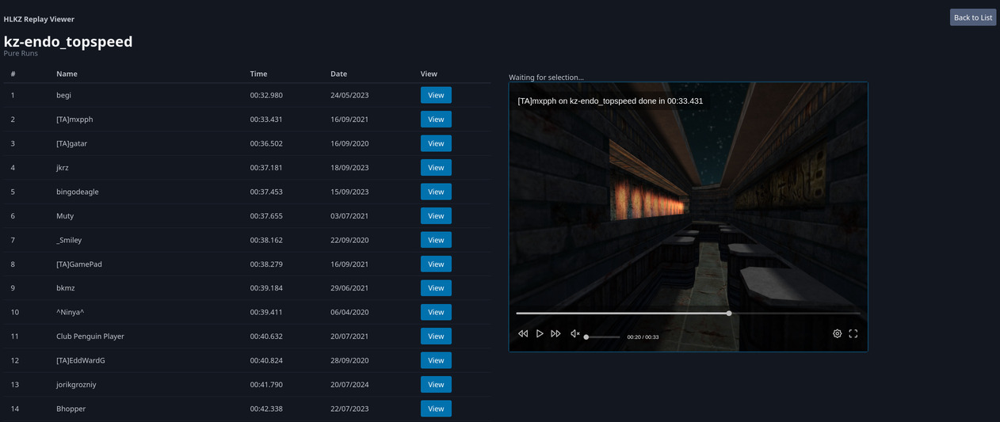

# HLKZ Replay Viewer

View HLKZ replays in the browser.



## Usage

Clone the repository via `git clone https://github.com/mxpph/hlkz-replay-viewer.git`

Create a `.env` file and follow the template in `.env.example`. Importantly, you need the URL for replays to be downloaded from.

Ensure that Docker is installed. Then, launch the container with
```
docker build -t hlkz-replay-viewer .
docker run -p 3000:3000 hlkz-replay-viewer
```
replacing 3000 with whichever port you chose in .env.
